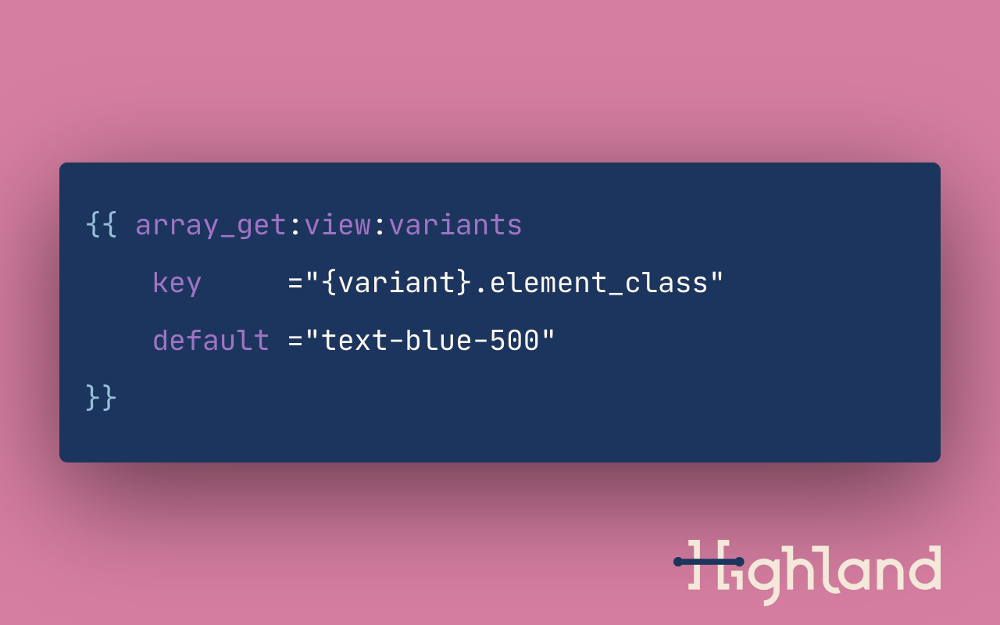

# Statamic Array Get


This addon helps you **DRY up your templates** with a tag that makes it trivial to output data nested in arrays with variable keys.

For the Laravel devs out there, this works very similarly to the [`Arr::get()`][laravel-array-get] (or the old `array_get()`) helper.

[Looking for the docs?](./docs.md)


## Why?
I use it most often to **simplify markup for component variants**.

For example, on [Highland's website][highland-website] we use several different color variants for our navbar and logo. Each variant requires setting several classes across six elements.

<details>
  <summary>
    Rather than repeating markup with slight differences…
  </summary>

  ```handlebars
  <!--
    Note this example strips out a lot of complexity surrounding responsive 
    design and JavaScript-powered mobile behavior.
  -->
  {{ if navbar_variant === 'blue_tan_pink' }}
    <nav>
      <header class="bg-blue-500">
        <a href="/">
          {{ partial:components/svg/logo
              p_logo_type_class     ="text-tan-200"
              p_logo_crossbar_class ="text-pink-400"
          }}
        </a>
        <ol>
          {{ links }}
            <a href="{{ url }}" class="text-white">
          {{ /links }}
        </ol>
      </header>
    </nav>


  {{ elseif navbar_variant === 'blue_tan_peach' }}
    <nav>
      <header class="bg-blue-500">
        <a href="/">
          {{ partial:components/svg/logo
              p_logo_type_class     ="text-tan-200"
              p_logo_crossbar_class ="text-peach-300"
          }}
        </a>
        <ol>
          {{ links }}
            <a href="{{ url }}" class="text-white">
          {{ /links }}
        </ol>
      </header>
    </nav>

    <!-- Insert several more variants. -->
  {{ /if }}
  ```
</details>


<details>
  <summary>
    …or a bunch of conditionals inside class attributes…
  </summary>

  ```handlebars
  <!--
    Note this example strips out a lot of complexity surrounding responsive 
    design and JavaScript-powered mobile behavior.
  -->
  <nav>
    <header class="{{ if navbar_variant === 'blue_tan_pink' }}bg-blue-500{{ elseif navbar_variant === 'blue_tan_peach' }}bg-blue-500 <!-- MOAR VARIANTS -->{{ /if }}">
      <!-- Let's just stop there on this one... -->
  </nav>
  ```
</details>


<details>
  <summary>
    …or a bunch of conditionals inside section/yield tags…
  </summary>

  ```handlebars
  <!--
    Note this example strips out a lot of complexity surrounding responsive 
    design and JavaScript-powered mobile behavior.
  -->
  {{ if navbar_variant === 'blue_tan_pink' }}
    {{ section:navbar_header_class }}
      bg-blue-500
    {{ /section:navbar_header_class }}
    
    {{ section:logo_type_class }}
      text-tan-200
    {{ /section:logo_type_class }}

    {{ section:logo_crossbar_class }}
      text-pink-400
    {{ /section:logo_crossbar_class }}

    {{ section:navbar_links_class }}
      text-white
    {{ /section:navbar_links_class }}

  {{ elseif navbar_variant === 'blue_tan_peach' }}
    {{ section:navbar_header_class }}
      bg-blue-500
    {{ /section:navbar_header_class }}
    
    {{ section:logo_type_class }}
      text-tan-200
    {{ /section:logo_type_class }}

    {{ section:logo_crossbar_class }}
      text-peach-300
    {{ /section:logo_crossbar_class }}

    {{ section:navbar_links_class }}
      text-white
    {{ /section:navbar_links_class }}

    <!-- Insert several more variants. -->
  {{ /if }}

  <nav>
    <header class="{{ yield:navbar_header_class }}">
      <a href="/">
        {{ partial:components/svg/logo
            p_logo_type_class     ="{yield:logo_type_class}"
            p_logo_crossbar_class ="{yield:logo_crossbar_class}"
        }}
      </a>
      <ol>
        {{ links }}
          <a href="{{ url }}" class="{{ yield:navbar_links_class }}">
        {{ /links }}
      </ol>
    </header>
  </nav>
  ```
</details>


<details>
  <summary>
    …configure your variants with front-matter!
  </summary>

  ```yaml
  navbar_variants:
    # Variants are named by colors used for navbar background, logo text color, 
    # and logo crossbar color, respectively.
    blue_tan_pink:
      navbar_header_class:        bg-blue-500
      navbar_logo_type_class:     text-tan-200
      navbar_logo_crossbar_class: text-pink-400
      navbar_menu_button_class:   text-white
      navbar_links_class:         text-white hover:text-blue-100
      navbar_last_link_class:     text-white
    blue_tan_peach:
      navbar_header_class:        bg-blue-500
      navbar_logo_type_class:     text-tan-200
      navbar_logo_crossbar_class: text-peach-300
      navbar_menu_button_class:   text-white
      navbar_links_class:         text-white hover:text-blue-100
      navbar_last_link_class:     text-white
    # Insert several more variants.
  ```

  ```handlebars
  <nav>
    <header class="{{ array_get:view:navbar_variants key='{navbar_variant}.navbar_header_class' }}">
      <a href="/">
        {{ partial:components/svg/logo
            p_logo_type_class     ="{array_get:view:navbar_variants key='{navbar_variant}.navbar_logo_type_class'}"
            p_logo_crossbar_class ="{array_get:view:navbar_variants key='{navbar_variant}.navbar_logo_crossbar_class'}"
        }}
      </a>
      <ol>
        {{ links }}
          <a href="{{ url }}" class="{{ array_get:view:navbar_variants key='{navbar_variant}.navbar_links_class' }}">
        {{ /links }}
      </ol>
    </header>
  </nav>
  ```
</details>


This approach often **makes it way easier to add more variants later**.


[highland-website]:  https://highlandsolutions.com/
[laravel-array-get]: https://laravel.com/docs/8.x/helpers#method-array-get
